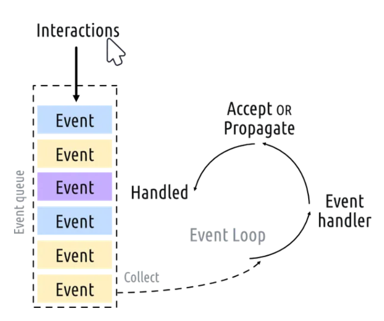

---
Qt common practices when making code
---

1. Code Structure and Modularity
    - Keep your code organised into functions and classes
    - Larger applications consider using
        - model
        - view
        - controller
    - ^ architecture

2. Memory Management
    - Make sure to properly disconnect signals and slots when objects are no longer needed
    - release any resources that are no longer in use

3. Performance Optimisation
    - Avoid unneccesary redrawing of widgets
    - Optimise any algorithms or data processing that occurs in the application

4. ~~Cross-Platform Consideration~~ 
    - Ensure different platforms are able to work out
    - Different platforms will lead to different behaviours


---
### Learning how to use QT Python
---
[Source](https://www.pythonguis.com/pyside6-tutorial/) 

# Tutorial 1: Creating your first app with PySide6

- QApplication: app handler
- QWidget: basic empty GUI widget

- We start by loading in the moduel for pyside6, then create an instance of QApplication into the sys.argv, containing a Python list with command line arguments to be passed into the app
```python
from PySide6.QtWidgets import QApplication, QWidget
app = QApplication(sys.argv)

window = QWidget()
window.show()
```

Then using `app.exec()`, we can execute the event loop

*what is an event loop?*



Every interactiong with the application generates an event that is placed on the event queue
The event queue goes through the list and passes the event through the event handler if spotted
Only 1 execution can be done at a time
